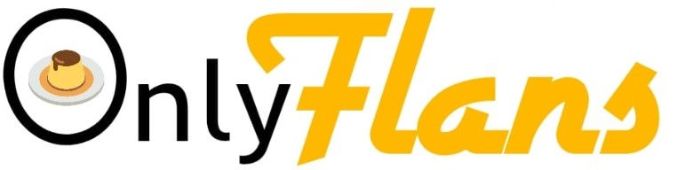

# Desarollo Proyecto Modulo 6 Desafío Latam

OnlyFlans es un proyecto de sitio web desarrollado en Django para una PYME dedicada a la venta de pasteles y postres, con un enfoque especial en el flan. El objetivo principal del sitio es presentar los productos de la empresa al público en general, así como también ofrecer productos especiales exclusivos para usuarios registrados.

## Requisitos de Instalación

Para ejecutar este proyecto localmente, asegúrate de tener instalado lo siguiente:

```bash
    asgiref==3.8.1
    Django==5.1.2
    sqlparse==0.5.1
    tzdata==2024.2
```


## Screenshots
<details>

<summary>Hito 1</summary>


</details>
<details>

<summary>Hito 2</summary>
    


    
</details>

## Autor

- [Xiorely Herrera](https://github.com/Xiorelyh)

## Licencia

Este proyecto está bajo la Licencia MIT - ve el archivo [LICENSE.md](LICENSE) para detalles


